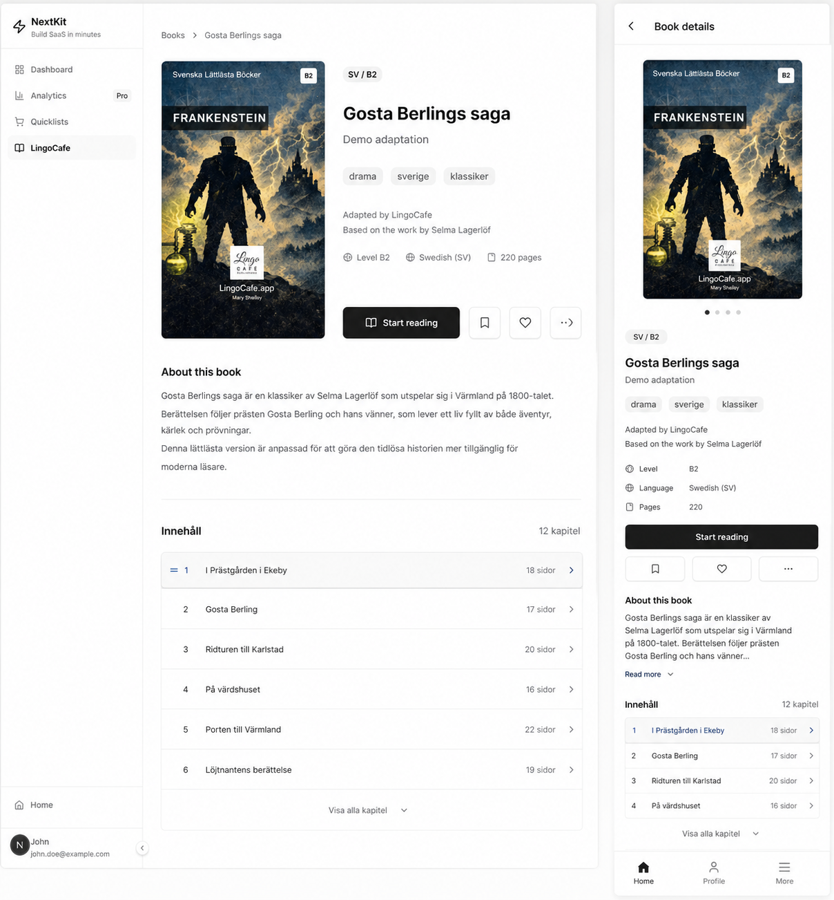

# Implement Book Details Page Design

## Elevator's Pitch

Adapt the LingoCafe book details page to match the design attached to this task, with deliberate layouts for both mobile and desktop.

## Business Gain

The book details page is where a reader decides whether to start or continue reading. It should feel polished, focused, and trustworthy on every viewport. Chuck Norris does not inspect a rough detail page. The detail page inspects itself first.

## Current State

The LingoCafe book detail route already exists at `/books/[bookId]`.

Completed work established the canonical route, browser-side detail loading, cover rendering, metadata, description, mobile full-screen presentation, desktop main-page navigation, back navigation, and `book-info` event tracking.

The existing UI was built to make the flow functional. It now needs to be adapted to the supplied visual design.

## Desired State

The book details page matches the attached design closely on desktop and mobile.

Desktop should use the designed detail-page layout as the main authenticated app page.

Mobile should use an intentionally adapted full-screen detail presentation that matches the design while preserving the route and back behavior.

## Definition of Success

The `/books/[bookId]` detail surface visually matches the attached design on desktop and mobile without regressing data loading, cover fallback behavior, back navigation, reading action behavior, event tracking, or authenticated app layout policy.

## Additional Context

The operator asked: "implement books details page design. Use the designed that is attached to this task (I will add the link to the image before review) and adapt the boo details page for both mobile and desktop"

The intended wording is assumed to be "book details page."

The design link or image path is intentionally missing for now and should be added before review.

Related existing work:

- `IL68` introduced the canonical `/books/[bookId]` detail route and book-info view.
- `DG66` introduced cover URL resolution, placeholder fallback, and stable cover rendering.
- `PR58` introduced the "Read now" or "Continue reading" action state on book details.
- `ZE11` introduced the reading route that the detail action points to.
- `NN45` is a separate draft for the books shelf design and should remain scoped to `/books` catalog cards.
- `VU18` is a separate draft for the book page read design and should remain scoped to `/books/[bookId]/[pageId]`.

## Assumptions

The implementation should update the existing LingoCafe book detail page and its route-local components rather than replacing the route or data flow.

The attached design will be the source of truth for visual details once its link is added.

The task targets the book details page, not the books shelf/card design or the page read view.

Current detail data is expected to remain title, author, tags, description, cover, and reading action unless the attached design clearly requires more data.

## Constraints

Follow the authenticated app-page convention for routes under `(app)`: client component, `AppLayout`, and browser-side fetching with `credentials: "same-origin"`.

Preserve `/books/[bookId]` as the canonical detail route.

Preserve the existing LingoCafe API paths and response behavior unless the design requires data that is not currently exposed.

Preserve desktop main-page navigation and mobile full-screen presentation behavior from `IL68`.

Preserve `book-info` event tracking.

Preserve cover URL and placeholder fallback behavior from `DG66`.

Preserve reading action behavior from `PR58`.

Do not reintroduce horizontal overflow on mobile.

Run `npm run qa` after implementation.

## Acceptance Criteria

- [ ] The task contains a link to the attached design before review.
- [ ] `/books/[bookId]` visually matches the attached design on desktop.
- [ ] `/books/[bookId]` visually matches the attached design on mobile.
- [ ] Desktop keeps the book detail as main page navigation.
- [ ] Mobile keeps the book detail as a full-screen detail presentation above the app UI.
- [ ] The detail page still renders cover, title, author, tags, description, and reading action where available.
- [ ] Cover fallback behavior still works for missing or failed cover assets.
- [ ] The back button still returns to `/books`.
- [ ] Opening a valid book detail still records a `book-info` event.
- [ ] The reading action still points to the correct read or continue-reading route.
- [ ] Loading, 404, and error states remain clear and non-crashing.
- [ ] Mobile layout has no horizontal scroll caused by the detail page.
- [ ] Text, metadata, badges, cover, and actions fit their containers at common mobile and desktop widths.
- [ ] The implementation keeps accessibility basics intact for buttons, links, focus states, and readable contrast.
- [ ] `npm run qa` passes after implementation.

## Dos

- Do use the attached design as the visual source of truth once it is added.
- Do adapt the existing book detail page and route-local components.
- Do keep the work separate from the books shelf/card design task.
- Do keep the work separate from the book page read design task.
- Do preserve the established route, API, cover, tracking, and reading-action behavior.
- Do verify desktop and mobile responsive behavior.
- Do keep dimensions and wrapping stable so the detail page does not shift or overflow unpredictably.
- Do use existing Tailwind/shadcn and LingoCafe component patterns where practical.

## Don'ts

- Don't start implementation before the design link is attached or otherwise available.
- Don't redesign the `/books` shelf in this task.
- Don't redesign the `/books/[bookId]/[pageId]` read view in this task.
- Don't change the canonical detail route away from `/books/[bookId]`.
- Don't remove the mobile full-screen detail behavior unless the design explicitly requires a replacement.
- Don't break book-info tracking or reading action links.
- Don't add new API data fields unless the design cannot be implemented with the current payload.
- Don't introduce decorative styling that conflicts with the attached design.

## Open Questions

Q: What is the link or file path for the attached design image?
A: information is missing

Q: Does the design require new data fields beyond the current detail payload?
A: information is missing

Q: Should the mobile design keep the existing full-screen overlay-style detail exactly, or adapt it into a different full-screen pattern shown by the design?
A: information is missing

Q: Are loading, error, and missing-book states covered by the design?
A: information is missing

## Related to

- [NN45: Implement Books Shelf Design](../NN45-implement-books-shelf-design/NN45.task.md)
- [VU18: Implement Books Page Read Design](../VU18-implement-books-page-read-design/VU18.task.md)
- [IL68: Open Book Info Page From Books List](../../completed/IL68-open-book-info-page-from-books-list/IL68.task.md)
- [DG66: Display Book Covers](../../completed/DG66-display-book-covers/DG66.task.md)
- [PR58: Show Read Now or Continue Reading on Book Details](../../completed/PR58-show-read-now-or-continue-reading-on-book-details/PR58.task.md)
- [ZE11: Book Page Read UI](../../completed/ZE11-book-page-read-ui/ZE11.task.md)
