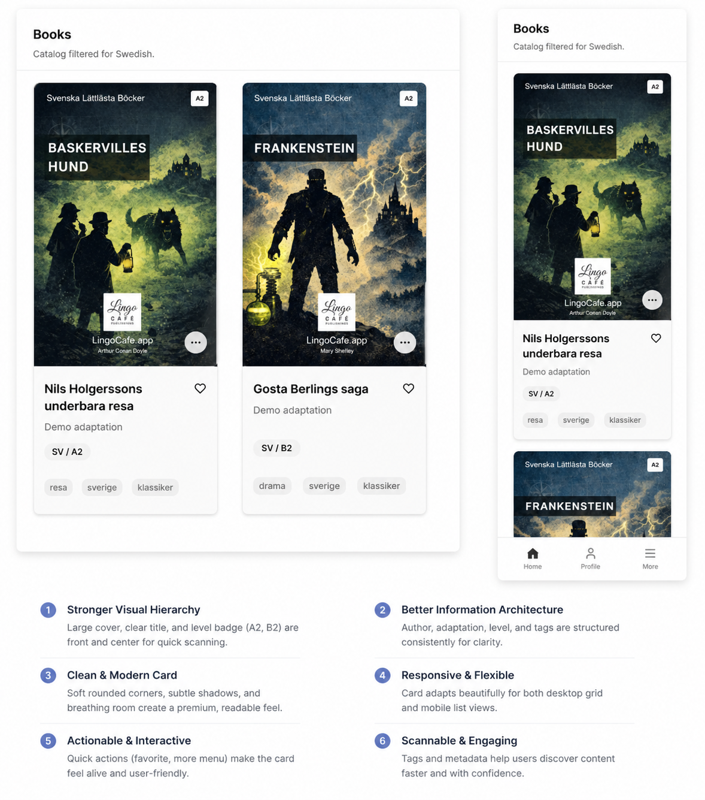

# Implement Books Shelf Design

## Elevator's Pitch

Adapt the LingoCafe books shelf and book card component to match the design attached to this task, covering both desktop and mobile layouts.

## Business Gain

The books shelf is the first catalog surface readers see. It should look deliberate, polished, and easy to scan on every device. Chuck Norris does not browse a bland shelf. The shelf straightens itself.

## Current State

The LingoCafe `/books` route already loads the language-filtered catalog, displays book covers, and links into book detail and reading flows.

The existing book card UI was built incrementally while the catalog, covers, details, and reading actions were introduced. It now needs to be aligned with the dedicated shelf design.

The final design reference is expected to be attached to this task before review.

## Desired State

The books shelf UI matches the attached design closely for both desktop and mobile.

The book card component should use the designed structure, spacing, cover treatment, typography, metadata presentation, and responsive behavior while preserving the existing catalog functionality.

Desktop should feel like a proper shelf/grid experience. Mobile should be intentionally adapted to the smaller viewport rather than merely squeezed down from desktop.

## Definition of Success

The `/books` catalog renders book cards that visually match the attached shelf design on desktop and mobile, without regressing cover rendering, language-filtered catalog loading, book-detail navigation, onboarding, or authenticated app layout behavior.

## Additional Context

The operator asked: "implement books shelf design. Use the designed that is attached to this task (I will add the link to the image before review) and adapt the book card component to match it for both desktop and mobile design."

This task is about applying the supplied visual design to the existing LingoCafe shelf/card surface. The design image link is intentionally missing for now and should be added before review.

Relevant completed work already established the current catalog surface:

- `PK51` introduced the real language-filtered `/books` catalog.
- `DG66` introduced cover rendering, placeholder handling, fixed `2:3` cover frames, and mobile overflow fixes.
- `IL68` introduced book-detail navigation from the list.
- `PR58` added reading action state on book details.
- `ZE11` introduced the reading UI.

## Assumptions

The implementation should update the existing LingoCafe books card/shelf components rather than replace the catalog flow.

The attached design will be the source of truth for visual details once its link is added.

The existing cover dimensions and fallback behavior from `DG66` should remain valid unless the attached design explicitly requires a different treatment.

## Constraints

Follow the authenticated app-page convention for routes under `(app)`: client component, `AppLayout`, and browser-side fetching with `credentials: "same-origin"`.

Preserve the existing LingoCafe API paths and response behavior.

Preserve the book-detail route behavior established by `IL68`.

Do not reintroduce horizontal overflow on mobile.

Do not make text, badges, covers, or actions overlap at desktop or mobile breakpoints.

Use the existing Tailwind/shadcn patterns and local component structure where practical.

Run `npm run qa` after implementation.

## Acceptance Criteria

- [ ] The task contains a link to the attached design before review.
- [ ] The `/books` shelf visually matches the attached design on desktop.
- [ ] The `/books` shelf visually matches the attached design on mobile.
- [ ] The book card component is adapted to the designed structure and styling.
- [ ] Book covers continue to render through the existing cover URL and placeholder behavior.
- [ ] The book card remains clickable and still opens `/books/[bookId]`.
- [ ] The shelf still works with language-filtered catalog results from `/api/lingocafe/books`.
- [ ] Empty, loading, and onboarding states are not regressed.
- [ ] Mobile layout has no horizontal scroll caused by the shelf or card.
- [ ] Text, metadata, badges, and actions fit their containers at common mobile and desktop widths.
- [ ] The implementation keeps accessibility basics intact for clickable cards and visible focus states.
- [ ] `npm run qa` passes after implementation.

## Dos

- Do use the attached design as the visual source of truth once it is added.
- Do adapt the existing book card component instead of rebuilding unrelated catalog behavior.
- Do preserve the current cover fallback and `next/image` rendering path.
- Do verify desktop and mobile responsive behavior.
- Do keep card dimensions and text wrapping stable so the shelf does not shift unpredictably.
- Do stay within the LingoCafe books route/component area unless shared styling already exists for this exact purpose.

## Don'ts

- Don't start implementation before the design link is attached or otherwise available.
- Don't change the catalog API unless the design requires data that is not currently exposed.
- Don't break book-detail navigation.
- Don't regress the mobile overflow fixes from the cover work.
- Don't introduce decorative styling that conflicts with the attached design.
- Don't solve unrelated book detail or reading page design work in this task.

## Open Questions

Q: What is the link or file path for the attached design image?
A: information is missing

Q: Does the design require new data fields beyond the current book card payload?
A: information is missing

Q: Should the desktop shelf use a fixed number of columns, an auto-fit grid, or another layout shown by the design?
A: information is missing

Q: Should mobile cards be stacked, horizontal, carousel-like, or another pattern shown by the design?
A: information is missing

## Related to

- [PK51: Show Language-Filtered LingoCafe Books](../../completed/PK51-show-language-filtered-lingocafe-books/PK51.task.md)
- [DG66: Display Book Covers](../../completed/DG66-display-book-covers/DG66.task.md)
- [IL68: Open Book Info Page From Books List](../../completed/IL68-open-book-info-page-from-books-list/IL68.task.md)
- [PR58: Show Read Now or Continue Reading on Book Details](../../completed/PR58-show-read-now-or-continue-reading-on-book-details/PR58.task.md)
- [ZE11: Book Page Read UI](../../completed/ZE11-book-page-read-ui/ZE11.task.md)
