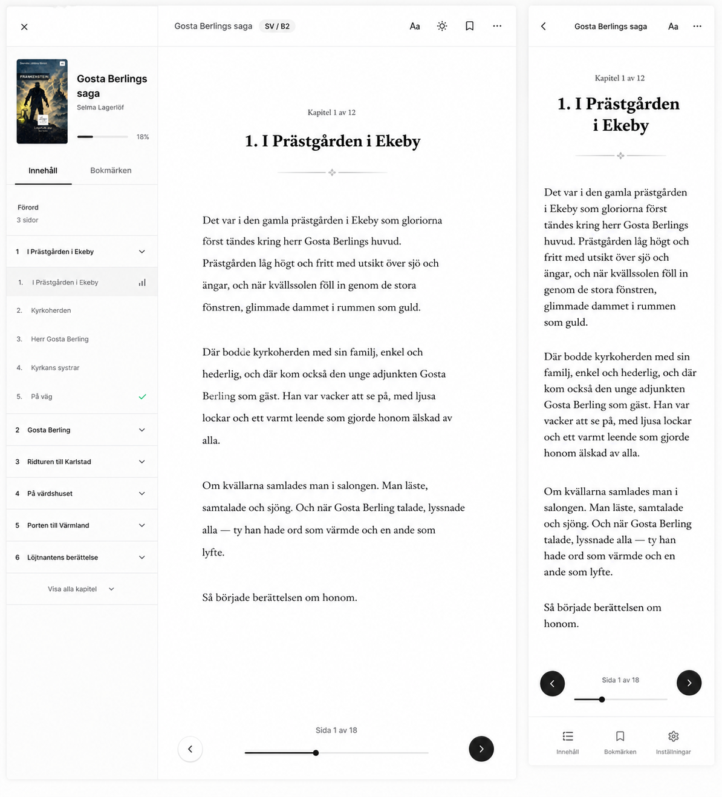

# Implement Books Page Read Design

## Elevator's Pitch

Adapt the LingoCafe book page read view to match the design attached to this task, covering both desktop and mobile layouts.

## Business Gain

The reading experience should feel deliberate and polished instead of merely functional. Readers should get a clear, comfortable page view on desktop and mobile. Chuck Norris does not squint at a reader. The reader sharpens itself.

## Current State

`ZE11` implemented the existing `/books/[bookId]/[pageId]` read route, page API, markdown rendering, progress resume, `page-open`, `page-scroll`, and previous/next page controls.

The current read view exists and works as a functional reading surface, but it does not yet apply the new visual design.

The design reference is attached to this task as `read-page-design.png`.

The design shows a desktop reader with a full left book/navigation column, a top reader toolbar, centered long-form reading content, previous/next circular page buttons, and a bottom visual page progress control.

The design shows a mobile reader with a compact top bar, long-form reading content, previous/next circular page buttons, and a bottom visual page progress control. The visible design also shows a bottom toolbar, but the operator clarified that this mobile bottom toolbar should be dropped for the first release.

Investigation note: the current `AppLayout` owns the desktop sidebar and exposes `children`, top toolbar props, footer, padding controls, and mobile-menu hiding, but it does not expose a native custom desktop sidebar/content-column slot. The implementation should first verify whether the designed desktop side column can be achieved cleanly with the existing layout capabilities. If not, the acceptable fallback is to make desktop use a full-screen custom reader popup/surface with this design, similar in spirit to the existing mobile full-screen read overlay.

## Desired State

The existing book page read view is restyled and adapted to follow the attached design for desktop and mobile.

Desktop should present the reader in a layout that matches the design while preserving the existing stable route, back navigation to book details, reading content, and previous/next navigation.

Desktop should preferably use the designed left book/navigation column if the current layout can support it cleanly. If the app layout cannot natively host a custom full-height side column, desktop may instead render the reader as a custom full-screen popup/surface that contains the designed left column and reading area without fighting the global app sidebar.

Mobile should match the design while preserving the current full-screen read view behavior above the book details view, including back navigation that reveals the book details underneath.

Mobile should not include the design's bottom toolbar. The `Innehåll`, `Bokmärken`, and `Inställningar` controls should be moved into the top-right `...` menu for the first release.

The `Aa`, theme/sun, bookmark, and overflow controls can be rendered as UI placeholders only. They should be isolated in the component so they can be commented out or removed easily before first release.

The bottom horizontal control is a visual aid for book-level progress across pages and next/previous navigation. It is not the source of saved scroll progress. Saved reader progress remains based on vertical scroll within the current page.

## Definition of Success

The book page read view visually matches the attached design closely enough for review on both mobile and desktop, while all behavior from `ZE11` still works: stable read URL, page content loading, progress resume from vertical scroll position, scroll progress saving, event tracking, and neighboring page navigation.

The implementation either proves the designed desktop side column works inside the current app layout or uses the approved full-screen desktop custom reader fallback without breaking navigation.

## Additional Context

The operator asked: "implement books page read design. Use the designed that is attached to this task (I will add the link to the image before review) and adapt the page read view for both mobile and desktop"

The design image is stored next to this task as `read-page-design.png`.

`ZE11` is the direct prior implementation. Its execution notes record that the reader API uses `GET` and `POST` on `/api/lingocafe/books/[bookId]/pages/[pageId]`, keeps markdown rendering route-local and restricted, uses a mobile read overlay above the existing book detail overlay, and batches scroll reporting in a 10-second client window.

`NN45` is a sibling draft for implementing the books shelf design, so this task should stay focused on the read page and avoid taking over catalog/card styling.

`DJ89` is a sibling draft for implementing the book details page design, so this task should stay scoped to `/books/[bookId]/[pageId]`.

The operator clarified:

- Investigate whether the current layout can host the designed full side column as customized content. If not, implement the desktop reader as a full-screen custom popup/surface using this design.
- Toolbar controls such as `Aa`, theme, bookmark, and `...` can be UI placeholders. Keep them easy to comment out because they are not part of the first release.
- `NN45` implements a similar placeholder-control approach for shelf-card actions.
- Saved page progress is still based on vertical scroll in the page.
- The bottom horizontal scroller is only a visual aid for book-level progress when moving between previous and next pages.
- On mobile, drop the bottom toolbar and put those controls inside the top-right `...` menu.

## Assumptions

The new work is primarily UI adaptation, not a new reader route or API rewrite.

The attached design defines the visual target for spacing, typography, controls, and responsive layout.

The existing reader behavior from `ZE11` should remain intact unless the design explicitly requires a small interaction adjustment.

The designed desktop side column may require a custom reader surface because `AppLayout` does not currently expose a custom desktop sidebar slot.

The placeholder toolbar controls do not need real settings, bookmark, typography, theme, contents, or bookmarks behavior for the first release.

## Constraints

Keep the read route as `/books/[bookId]/[pageId]`.

Keep the page API contract compatible with the current read view.

Preserve server-side validation and authenticated progress updates.

Do not weaken the restricted markdown rendering path.

Follow the app-page convention for authenticated app routes.

Before implementing the desktop side column, investigate whether it can be achieved with the current `AppLayout` without broad layout refactoring.

If the current layout cannot host the designed side column cleanly, use the approved full-screen desktop custom reader popup/surface fallback.

Do not implement real behavior for `Aa`, theme, bookmark, bookmarks tab, contents tab, settings tab, or overflow-menu actions in this task.

Keep placeholder controls isolated and easy to remove or comment out before first release.

On mobile, do not render the bottom toolbar from the design. Put those controls in the top-right `...` menu as placeholders.

Do not make the bottom horizontal progress aid update saved `books_progress.progress_bps`; saved progress remains based on vertical scroll.

Run `npm run qa` after implementation.

## Acceptance Criteria

- [ ] The implementation uses the attached design as the visual reference for the book page read view.
- [ ] The task uses `docs/backlog/drafts/VU18-implement-books-page-read-design/read-page-design.png` as the design reference.
- [ ] Implementation investigates whether the current `AppLayout` can host the designed full desktop side column without broad layout refactoring.
- [ ] If the current layout can host the desktop side column cleanly, the desktop reader uses the designed side column.
- [ ] If the current layout cannot host the desktop side column cleanly, the desktop reader uses a full-screen custom reader popup/surface with the designed layout.
- [ ] Desktop read view matches the attached design's layout, spacing, typography, and controls as closely as practical.
- [ ] Mobile read view matches the attached design's layout, spacing, typography, and controls as closely as practical.
- [ ] Desktop still includes a clear path back to the book detail route.
- [ ] Mobile still behaves as a full-screen read view above the book details view.
- [ ] Mobile back navigation reveals the book details view underneath.
- [ ] Mobile does not render the design's bottom toolbar.
- [ ] Mobile exposes the first-release placeholder controls through the top-right `...` menu instead.
- [ ] `Aa`, theme/sun, bookmark, and overflow/menu controls are implemented as UI placeholders only.
- [ ] Placeholder controls are isolated enough that they can be commented out or removed easily before first release.
- [ ] No real typography settings, theme switching, bookmark persistence, bookmarks panel, contents panel, or settings panel behavior is implemented in this task.
- [ ] The bottom horizontal control is rendered as a visual aid for book-level page progress and previous/next movement.
- [ ] The bottom horizontal control does not replace vertical scroll tracking as the source of saved page progress.
- [ ] The read URL remains `/books/[bookId]/[pageId]`.
- [ ] Refreshing the read URL still reopens the same book page.
- [ ] Existing `progress_bps` resume behavior still works.
- [ ] Existing `page-open` tracking still works.
- [ ] Existing `page-scroll` tracking and progress persistence still work.
- [ ] Previous and next page controls still work when neighboring pages exist.
- [ ] The reader remains usable at common mobile and desktop viewport sizes.
- [ ] UI text and controls do not overlap or overflow on mobile.
- [ ] `npm run qa` passes after implementation.

## Dos

- Do treat the attached image as the source of truth for the read view's visual direction.
- Do reuse the existing reader route and data flow from `ZE11`.
- Do investigate the current `AppLayout` before committing to the desktop side-column implementation path.
- Do use the full-screen desktop custom reader fallback if the designed side column cannot be implemented cleanly inside the existing layout.
- Do keep the UI responsive instead of creating separate behavior that diverges between mobile and desktop.
- Do preserve accessibility for navigation controls and readable text contrast.
- Do verify both mobile and desktop layouts before review.
- Do treat toolbar and tab controls as first-release placeholders only.
- Do keep placeholder controls easy to remove.
- Do keep vertical scroll tracking as the persistence source for page progress.
- Do treat the bottom horizontal progress control as a book-level visual aid.
- Do put mobile secondary controls into the top-right `...` menu.

## Don'ts

- Don't rebuild the reader API unless the design adaptation exposes a real technical need.
- Don't change the read URL shape.
- Don't remove progress resume, event tracking, or previous/next navigation.
- Don't make mobile a small modal if the current layered full-screen read flow is still required.
- Don't let this task absorb the books shelf/card design work from `NN45`.
- Don't let this task absorb the book details page design work from `DJ89`.
- Don't broadly refactor `AppLayout` unless implementation proves there is no smaller safe path.
- Don't implement real bookmark, typography, theme, contents, settings, or overflow-menu behavior in this task.
- Don't render the mobile bottom toolbar from the design for the first release.
- Don't make the bottom horizontal control the persisted scroll-progress source.

## Open Questions

Q: What is the final image link for the attached design?
A: `docs/backlog/drafts/VU18-implement-books-page-read-design/read-page-design.png`

Q: Does the design include different states for loading, errors, first page, and last page?
A: information is missing

Q: Does the design require changes to the reader controls beyond visual styling?
A: Yes, but only as visual placeholders for first release. `Aa`, theme/sun, bookmark, and overflow/menu controls can be rendered, but they should not implement real behavior and should be easy to comment out or remove.

Q: Should the desktop design's full side column be implemented inside the existing app layout?
A: Investigate first. If the current layout can support a custom full-height side column cleanly, implement it. If not, use a full-screen desktop custom reader popup/surface with the designed side column and reading area.

Q: Should mobile include the bottom toolbar shown in the design?
A: No. Drop the mobile bottom toolbar and move those controls into the top-right `...` menu as placeholders.

Q: What should the bottom horizontal scroller control do?
A: It is a visual aid for book-level progress across pages and next/previous movement. Saved progress remains based on vertical scroll in the page.

## Related to

- [ZE11: Book Page Read UI](../../completed/ZE11-book-page-read-ui/ZE11.task.md)
- [NN45: Implement Books Shelf Design](../NN45-implement-books-shelf-design/NN45.task.md)
- [DJ89: Implement Book Details Page Design](../DJ89-implement-book-details-page-design/DJ89.task.md)
- [PR58: Show Read Now or Continue Reading on Book Details](../../completed/PR58-show-read-now-or-continue-reading-on-book-details/PR58.task.md)
- [IL68: Open Book Info Page From Books List](../../completed/IL68-open-book-info-page-from-books-list/IL68.task.md)
